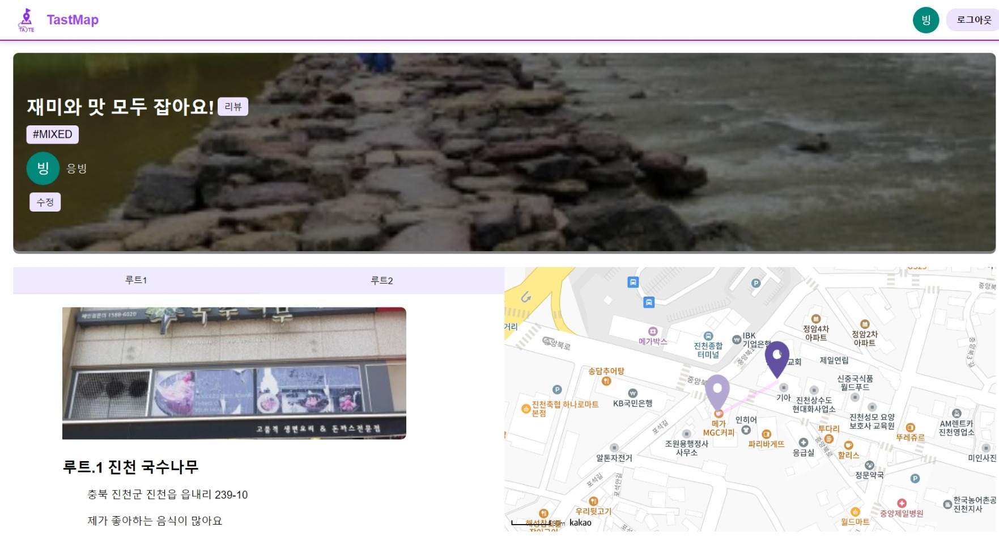
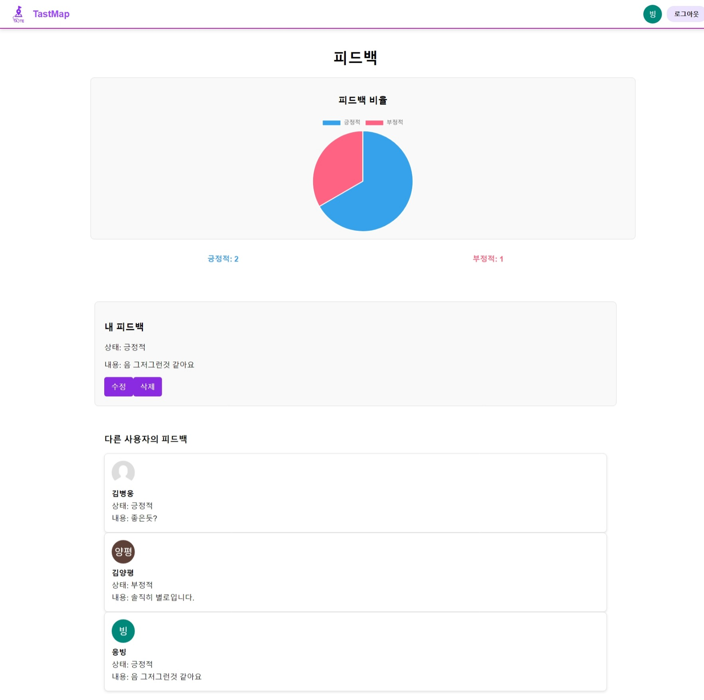

  

# 📌나만의 먹거리루트 : TasteMap (개인 프로젝트)
**✏내가 만들고 싶은거 만들기 프로젝트✏**
 
2024/08/01 ~ 2024/08/21(3주)
## 📖아이디어 
- 자신만의 먹거리 코스를 주소 기준으로 적어 루트를 생성
- 코스의 루트별로 지도에 표시하여 정해진 루트를 표시
- 사용자가 그걸보고 평가를 내릴 수 있음
  
 

## 아쉬운점
- 프론트엔드가 미흡하여 디자인을 모두 생성형 AI 사용
- 프론트엔드 단에서 서버에서 전해준 오류 코드에 대한 처리 미흡 

 
## 기능 소개

| 페이지          | 설명                                                                                     |
|-----------------|------------------------------------------------------------------------------------------|
| 메인            | 주요 기능이나 홈 화면을 표시하는 페이지로, 애플리케이션의 중심적인 역할을 합니다. |
| 로그인          | 사용자 인증 기능으로 OAuth2.0을 이용한 소셜 로그인 네이버, 구글을 지원합니다. |
| 코스            | 사용자가 만든 코스와 루트를 확인할 수 있는 페이지입니다. |
| 생성            | 코스와 루트를 만드는 페이지로 모든 값이 필수 값입니다. |
| 평가            | 사용자가 해당 코스에 대해 평가하는 페이지로, 통계를 통한 확인도 가능합니다. |

| 기능   | 이미지                                      |
|--------|---------------------------------------------|
| 메인   |                   |
| 로그인 |                 |
| 코스   |               |
| 생성   |               |
| 평가   |           |
